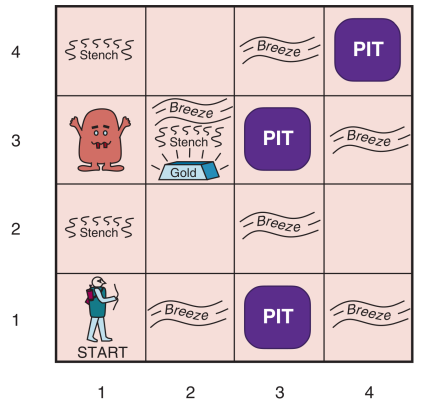

<!-- PROJECT LOGO -->
<br />
<p align="center">

  <h3 align="center">Propositional Logic/First Order Logic AI Agent in Wumpus world</h3>

  <p align="center">
    Knowledge, Reasoning and Planning Challenges :: Wumpus Problem :: Fundamentals of AI 
    <br />
  </p>
  </br>
  <p align="center">
    
  </p>
</p>

<!-- TABLE OF CONTENTS -->
<details open="open">
  <summary><h2 style="display: inline-block">Table of Contents</h2></summary>
  <ol>
    <li><a href="#about">About</a></li>
    <li><a href="#testing">Testing</a></li>
    <li><a href="#simulation">Simulation</a></li>
    <li><a href="#license">License</a></li>
    <li><a href="#contact">Contact</a></li>
  </ol>
</details>

<!-- ABOUT THE PROJECT -->

## About

|            AI Wumpus agent (Traditional map)            |            AI Wumpus agent (random map)            |
| :-----------------------------------------------------: | :------------------------------------------------: |
|  |  |

<div style="text-align: justify">
  
**Motivation**: If you want to learn Prolog, try to solve the Wumpus problem using Prepositional Logic or First-Order Logic. For the latter you can find a thorough discussion on section 8.4 from Artificial Intelligence: A Modern Approach. There are some solutions available in the Internet. Try to develop yours' own, even if that means you will be unable to complete it. Section 9.4.2 in this same book presents a quick introduction to Prolog.

Wumpus world is a classic problem in artificial intelligence. It is a classic example of a problem that can be solved using . In a wumpus world game there is a hunter(H) who wants to take gold(G) and get out of the cave from the initial position(1,1) without being killed by the wumpus(W) or fall in one of the three pits(P) placed on the map. The hunter has one arrow and only one opportunity to shoot and kill Wumpus. The hunter has four possible actions: move_forward, turn_left, turn_right, grab_gold, shoot and climb_out. Wumpus screams when it gets killed. Hunter can sense wumpus or a pit in adjacent cells. The hunter scores when he: gets gold(+1000), dies(-1000), takes_action(-1), shoot_arrow(-10).

**Implementation**: Prolog was the choosen programming language for this project as it was the ideal language for the task according to the book "Artificial Intelligence: A Modern Approach". We started by adding the sensors logic to the agent for it to be able to sense the world. We followed the logic presented on the book but we decided to replace both the bump and scream sensors with a flag because it was a better option to do in our implementation.

We then added the knowledge base to the agent for it to be able to calculate the cost of each future step/action. Finnaly we then added the planning logic to the agent to be able to plan the actions to be taken.
Each action is determined given the agent info like it current state aswell as the knowledge base and the sensors.

With the prolog logic implemented we've decided to create a user friendly interface to better follow the agent's actions instead of doing it from the console. We've also decided to create a random map for the agent to start with. For the game itself we've used Pygame with python and pyswip package to make the connection between swi-prolog and python. We then added a feature to the implementation where the user can test the game too.

</br>    
<p align="center">
    
    
<p align="center"><em>Wumpus game interface without the fog (pygame)</em></p>

  </p>
  </br>

**_Tested with_** with random placed wumpus, pits and gold in the map (70% win).

**_Built With_** Pygame (game interface) and SWI-Prolog for the AI agent/Wumpus game logic.

<!-- TESTING -->

## Testing

**Wrong weights**: when testing the implementation we've found that the agent was not able to solve the problem quite well. Initial the winning percentage was ~35% and after some testing we've decided to change the weights of each cost to be more accurate. i.e. now the agent has to check every single safe cell before doing a risky action.
After some tweaking we've improved the winning percentage to ~70% and there's still a lot of room for improvement since we haven't added the shoot action to the agent.

</div>

<!-- SIMULATION -->

## Simulation

### Prolog

```prolog
consult('sr/prolog/main.pl'). % load prolog file

run(user). % cli for user to test the game
run(map). % agent simulation on traditional map
run. % agent simulation on a random map w/ logs
```

### Python

```python
pip install -r requirements.txt # pygame and pyswip

python main.py # agent simulation on a random map w/ interface
python main.py -user # playing mode for user to test the game
python main.py -map # run simulation on traditional map
```

## License

Distributed under the MIT License. See `LICENSE` for more information.

<!-- CONTACT -->

## Contact

Fábio Oliveira - [LinkedIn](https://www.linkedin.com/in/fabioo29/) - fabiodiogo29@gmail.com

Project Link: [https://github.com/fabioo29/ai-wumpus-world](https://github.com/fabioo29/ai-wumpus-world)  
Project built as a Msc. Applied Artificial Intelligence Student.
